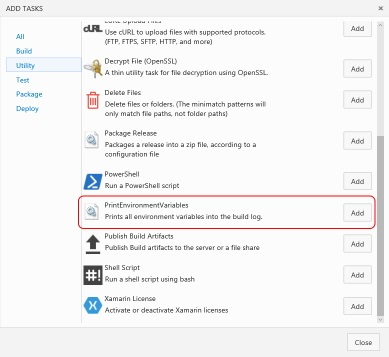

# kv-vsts-agent-tasks

Some custom tasks for use with the TFS 2015 and Visual Studio Team Services (VSTS) build and release agent.

# Available tasks
* [Print environment variables](Tasks/PrintEnvironmentVariables/) - Prints all environment variables to the build log.

# Using the tasks
In order to use the tasks, you'll first need to upload them to your VSTS account. Follow these steps to do so:

1. Clone this repository (if you didn't do this already)
2. Make sure you have NodeJS installed ([https://nodejs.org](https://nodejs.org))
3. Install tfx-cli through NPM: 

    `npm install -g tfx-cli`
4. Then connect to your VSTS account:

    `tfx login`
5. Finally, upload the task that you need:

    `tfx build tasks upload --task-path Tasks/<task folder>`
6. You'll then be able to select the uploaded task from the list of available tasks.

# Debugging
1. Clone this repository
2. Install Visual Studio Code from [https://code.visualstudio.com/](https://code.visualstudio.com/).
3. Make sure you have NodeJS installed ([https://nodejs.org](https://nodejs.org))
3. Install the PowerShell extension for Visual Studio Code 
4. Open the cloned repository in VS Code
5. Go to the debug tab (Ctrl+Shift+D)
6. Select the file & version (either JavaScript or PowerShell) that you want to debug from the dropdown

7. Hit the "Play" (or F5) icon to start debugging
8. Optionally, you can set the environment variables for debugging in the "launch.json" file (unfortunately this doesn't work for PowerShell yet because it's not supported in the VS Code PowerShell extension)

# Contributing
Feel free to fork this repository and submit a pull request if you have any improvements!

