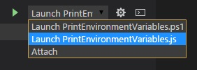

# kv-vsts-agent-tasks

Some custom tasks for use with the TFS 2015 and Visual Studio Team Services (VSTS) build and release agent.

# Available tasks
* Print environment variables

# Debugging
1. Clone this repository
2. Install Visual Studio Code from [https://code.visualstudio.com/](https://code.visualstudio.com/ "here").
3. Make sure you have NodeJS installed ([https://nodejs.org](https://nodejs.org))
3. Install the PowerShell extension for Visual Studio Code 
4. Open the cloned repository in VS Code
5. Go to the debug tab (Ctrl+Shift+D)
6. Select the file & version (either JavaScript or PowerShell) that you want to debug from the dropdown
7. Hit the "Play" (or F5) icon to start debugging
8. Optionally, you can set the environment variables for debugging in the "launch.json" file (unfortunately this doesn't work for PowerShell yet because it's not supported in the VS Code PowerShell extension)